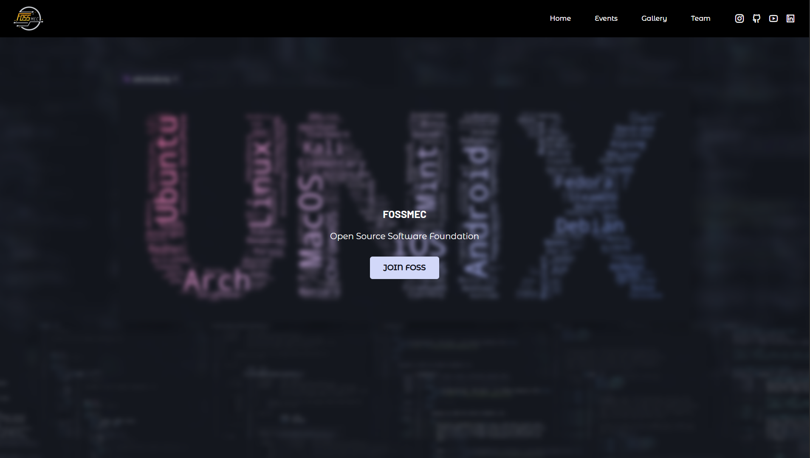

# Foss Mec Landing Page

[](https://developer.mozilla.org/en-US/docs/Web/HTML)
[](https://developer.mozilla.org/en-US/docs/Web/CSS)
[](https://developer.mozilla.org/en-US/docs/Web/JavaScript)

This repository contains the source code for the **Foss Mec** landing page, built using **HTML**, **CSS**, and **JavaScript**.

## Preview


## Features

* **Responsive Design**: Built to look great on all devices.
* **Easily Modifiable**: Content is rendered from static files and can be easily updated.
* **Interactive Components**: JavaScript is used to add interactivity.

## Running Locally

To run this project locally:

1. Clone the repository:
    ```bash
    git clone https://github.com/aditeya24/fossmec-webpage.git
    cd fossmec-webpage
    ```

2. Open `index.html` in your browser.

## License

This project is licensed under the MIT License.
